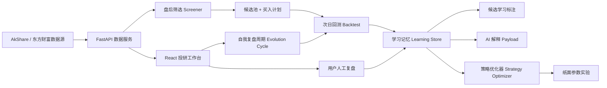
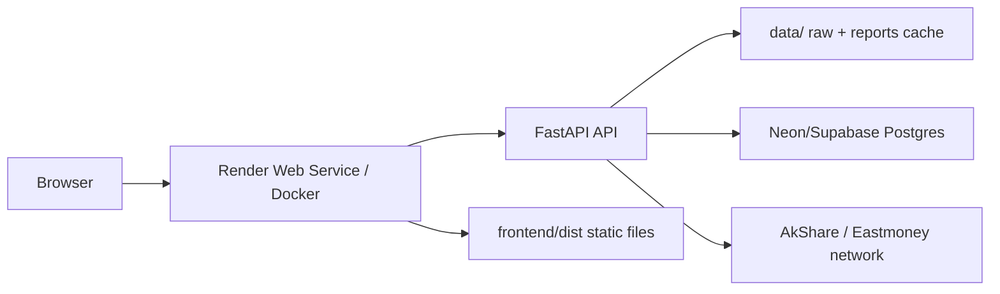

# Stock Opportunity Lab 技术架构

## 1. 系统目标

Stock Opportunity Lab 是一个面向 A 股盘后研究的本地优先量化投研工具。系统核心不是一次性给出股票推荐，而是形成可复盘、可归因、可吸收人工经验、可持续校准策略参数的闭环。

核心目标分成四层：

- 盘后发现机会：从全市场快照中筛选候选股，生成价格计划和证据摘要。
- 次日验证结果：用实际行情验证前一交易日推荐是否触发买入、是否盈利、是否出现回撤或止损暴露。
- 沉淀策略记忆：把每条推荐的结果、系统归因、用户复盘写入学习库。
- 自我进化策略：用历史学习样本反向影响后续候选排序、AI 解释和参数实验建议。

系统不自动交易，不连接券商，不承诺固定收益。所有推荐都必须回到数据证据、价格计划、历史回测和人工复盘。

## 2. 总体架构



前端是 Vite + React + Mantine + TanStack Query。后端是 FastAPI + pandas + AkShare。学习记忆和策略实验进入 SQLite/Postgres 数据库，行情快照和报告仍作为可重建缓存放在 `data/` 下。

## 3. 代码分层

| 层级 | 主要文件 | 职责 |
| --- | --- | --- |
| API 层 | `backend/app/main.py` | 暴露扫描、回测、学习、反馈、策略优化、自我复盘接口 |
| 请求模型 | `backend/app/models.py` | Pydantic 请求/响应结构，约束 API 边界 |
| 数据源 | `backend/app/services/data_provider.py` | AkShare/东方财富数据读取、缓存、测试 CSV provider |
| 盘后筛选 | `backend/app/services/screener.py` | 全市场过滤、评分、候选池、报告落盘 |
| 买入计划 | `backend/app/services/strategy.py` | 计划低吸价、买入上限、突破确认、止损止盈 |
| 次日回测 | `backend/app/services/backtest.py` | 验证推荐在实际交易日的触发、收益、回撤 |
| 学习记忆 | `backend/app/services/learning.py` | 学习记录、摘要、用户反馈、候选学习标注 |
| 策略优化 | `backend/app/services/strategy_optimizer.py` | 从学习样本生成保守参数实验建议 |
| 自我复盘 | `backend/app/services/evolution.py` | 编排最近盘后报告 -> 次日回测 -> 学习 -> 优化建议 |
| 公众号知识 | `backend/app/services/wechat_knowledge.py` | 保存公众号来源、导入文章、提取关键知识 |
| AI 解释 | `backend/app/services/ai.py` | 构造 AI payload，并生成规则化解释 |
| 前端工作台 | `frontend/src/App.tsx` | 页面路由、状态编排、策略进化 UI |

## 4. 数据流

### 4.1 盘后扫描

1. 前端调用 `POST /api/screen`。
2. 后端通过 `AkShareProvider.spot()` 获取指定交易日全市场快照。
3. `screener.apply_filters()` 按价格、成交额、换手率、量比、市值、涨跌幅、名称规则过滤。
4. `screener.score_candidates()` 计算候选分数。
5. `strategy.attach_buy_plan()` 为候选生成价格计划。
6. `learning.annotate_candidates_with_learning()` 读取历史学习库，给候选增加学习样本数、历史胜率、平均收益、学习动作和提示。
7. 扫描报告写入 `data/reports/screen_YYYYMMDD.*` 和 `screen_targets_YYYYMMDD.*`。

### 4.2 次日回测

1. 前端调用 `POST /api/backtest` 或自我复盘周期触发回测。
2. `backtest.run_backtest()` 加载某日盘后候选报告。
3. 对每只候选拉取实际交易日行情。
4. `strategy.simulate_next_day_entry()` 判断是否触发计划买入、买入方式、模拟买入价、收盘浮盈、盘中最大浮盈和最大回撤。
5. `backtest.risk_columns()` 标记是否触及止损、止盈、收盘是否站上计划上限。
6. `learning.persist_backtest_learning()` 把每一只候选转成学习记录并更新学习摘要。
7. 回测报告写入 `data/reports/backtest_SCREEN_to_ACTUAL.*`。

### 4.3 自我复盘周期

自我复盘周期是系统进化的自动入口，对应 `POST /api/evolution-cycle` 和 `backend/app/services/evolution.py`。

运行逻辑：

1. 输入实际交易日 `actual_date`。
2. 如果未指定 `screen_date`，系统用 `latest_screen_date(config, before=actual_date)` 找到实际日期之前最近一次盘后报告。
3. 调用 `run_backtest()` 验证这批推荐在实际日的表现。
4. 回测自动写入学习记录和学习摘要。
5. 调用 `build_strategy_optimization()` 生成参数实验建议。
6. API 返回嵌套的回测结果、学习摘要、策略优化建议和一条运行说明。

这个入口让系统可以每天做同一件事：复盘上一次推荐、记录结果、把证据带进下一次分析。

## 5. 自我进化原理

系统的“自我进化”不是神经网络在线训练，而是证据驱动的策略记忆闭环。它由四个机制组成。

### 5.1 每条推荐都变成样本

`learning.build_learning_record()` 会把回测行转换成稳定学习记录。记录 ID 是：

```text
screen_date:actual_date:code
```

这保证重复回测同一只股票时不会产生重复样本，同时保留用户已经写入的复盘备注。

每条学习记录包含：

- 推荐日期和验证日期
- 股票代码、名称、排名
- 是否触发买入
- 结果分类：`win`、`loss`、`missed`、`flat`、`unknown`
- 收盘收益、最大回撤、最大浮盈
- 是否触及止损/止盈
- 系统归因，例如“收盘浮盈为负”“盘中触及止损”“高开超阈值放弃”
- 当时的特征快照，例如板块、标签、成交额、换手率、价格计划
- 用户复盘备注

### 5.2 系统归因提供第一层解释

系统根据回测结果自动生成基础归因：

- 未触发：记录未触发原因，如高开超阈值、未到计划价格、缺少行情。
- 盈利：记录收盘浮盈、是否站上计划上限、是否触及止盈。
- 亏损：记录收盘浮亏、盘中回撤、是否触及止损。

这些归因不替代人工判断，但它们让每条样本有可统计的结构化原因。

### 5.3 用户复盘补充第二层知识

当前端“人工复盘”提交备注时，`append_user_feedback()` 会把用户判断追加到对应学习记录。重复回测不会覆盖这些备注。

人工复盘适合记录系统难以从行情字段里直接识别的原因，例如：

- 题材退潮
- 板块一致性转弱
- 高位缩量
- 消息兑现
- 大盘环境切换
- 用户自己的交易纪律判断

这些备注会在学习摘要和近期样本里展示，并进入后续分析上下文。

### 5.4 学习摘要反哺后续分析

`summarize_records()` 会聚合全部学习记录，生成：

- 总样本数
- 买入样本数
- 盈利买入数/亏损买入数
- 未触发样本数
- 买入胜率
- 平均买入收益
- 平均最大回撤
- 用户反馈数量
- 常见失败/未触发原因
- 常见成功原因
- 近期学习样本
- 距离 80% 胜率目标的差距

这些摘要会进入三个下游位置：

- AI payload：解释不再只看当天指标，而能引用历史策略记忆。
- 候选表：相似历史样本会显示学习动作，例如“优先跟踪”“降低优先级”“样本不足”。
- 策略优化器：用统计结果触发保守参数实验建议。

## 6. 策略优化原理

`strategy_optimizer.build_strategy_optimization()` 读取学习记录和当前策略参数，生成一个不自动生效的纸面实验计划。

当前启发式包括：

- 如果亏损买入样本中多次触及止损，且胜率低于 80%，建议小幅收紧 `stop_loss`。
- 如果买入胜率低于 80% 或平均回撤偏深，建议降低 `risk_per_trade_pct`。
- 如果未触发样本占比过高且已有买入胜率尚可，建议小幅放宽 `entry_premium` 进行纸面验证。

优化器返回：

- 当前指标
- 当前策略参数
- 建议策略参数
- 参数变化列表
- 置信度
- 纸面实验计划
- 风险声明

重要边界：

- 不自动改 `config.strategy`。
- 不自动下单。
- 不把 80% 胜率硬编码为现实结果，只把它作为目标和差距指标。
- 样本不足时优先建议继续积累和人工复盘，而不是贸然调参。

## 7. 前端交互架构

前端以路由页面组织工作流：

- `今日机会`：盘后扫描、候选表、机会中枢、候选证据抽屉。
- `个股分析`：单股检索、走势、价格计划、持仓判断。
- `回测实验室`：手动回测、策略进化、自我复盘周期、报告浏览。
- `消息异动`：盘中告警和分时观察。
- `板块资金`：候选池按板块/行业聚合。
- `策略设置`：本地偏好和通知配置。

策略进化相关状态由 TanStack Query 和 mutation 管理：

- `fetchLearningSummary()` 拉取学习摘要。
- `fetchStrategyOptimization()` 拉取参数实验建议。
- `submitLearningFeedback()` 写入人工复盘。
- `runEvolutionCycle()` 一键触发自我复盘周期，并刷新回测、学习摘要和优化建议。

## 8. 存储设计

当前存储分成两类：

```text
data/
  raw/                  # 全市场快照缓存
  history/              # 个股历史行情缓存
  reports/              # 扫描和回测报告
  stock_lab.sqlite3     # 默认本地学习数据库
```

长期学习数据由 `backend/app/services/learning_store.py` 管理，支持两种连接方式：

- 不配置 `STOCK_LAB_DATABASE_URL`：使用本地 SQLite，适合开发和单机运行。
- 配置 `STOCK_LAB_DATABASE_URL=postgresql://...`：使用 Postgres，适合 Render + Neon/Supabase 这类免费云端组合。

数据库核心表：

| 表 | 作用 |
| --- | --- |
| `learning_records` | 保存每条推荐的验证结果、系统归因、特征快照、用户复盘 |
| `strategy_experiments` | 保存每次参数建议的稳定实验版本 |
| `strategy_experiment_outcomes` | 保存同一实验版本在 baseline/proposed 下的后续表现 |
| `wechat_subscriptions` | 保存公众号来源、样例文章 URL 和可选 feed |
| `wechat_articles` | 保存导入文章正文和提取出的摘要、标签、机会、风险 |

`data/learning/records.json` 是旧格式。首次读取学习库时会自动导入数据库，之后新写入以数据库为准。

优点：

- 学习记录不再绑定单机 JSON 文件，适合长期样本积累。
- 多次相同参数建议会复用同一个实验 ID，避免重复建实验。
- 后续回测会把 baseline/proposed 表现写入实验结果表，形成策略 A/B 进化链。
- 测试环境仍可用临时 SQLite 文件完全隔离。

限制：

- 本地 SQLite 不适合多实例并发写入；多用户和云端长期运行应使用外部 Postgres。
- 免费 Postgres 有容量、休眠或计算时间限制，需要定期导出备份。
- 行情原始缓存和报告仍在 `data/`，免费容器重启后可能丢失；它们可重建，但学习库必须外置。

## 9. 部署架构

推荐部署形态是单容器：



单容器部署的原因：

- 前端用同源 `/api` 调后端，避免跨域和环境变量分裂。
- FastAPI 可以同时服务 API 和 Vite 构建后的静态文件。
- AkShare 和 pandas 更适合容器常驻服务，不适合纯静态平台。
- 自我进化需要稳定数据库，单容器负责计算，外部 Postgres 负责长期记忆。

当前 Render 免费实例适合演示，但不是生产级：

- 免费实例会休眠，首次访问有冷启动。
- Render Free Web Service 不能保留本地文件系统改动。
- 真正要持续进化，应配置 `STOCK_LAB_DATABASE_URL` 指向 Neon/Supabase/Turso 等外部存储。

## 10. 关键 API

| API | 方法 | 作用 |
| --- | --- | --- |
| `/api/screen` | POST | 盘后扫描并生成候选 |
| `/api/screen-report` | GET | 读取历史扫描报告 |
| `/api/backtest` | POST | 手动验证某次推荐在实际日的表现 |
| `/api/evolution-cycle` | POST | 自动选择最近盘后报告并完成回测、学习、优化建议 |
| `/api/learning-summary` | GET | 读取学习摘要 |
| `/api/learning-feedback` | POST | 写入人工复盘 |
| `/api/strategy-optimization` | GET | 读取纸面参数实验建议、实验版本和历史结果 |
| `/api/wechat-knowledge` | GET | 读取公众号订阅和文章知识 |
| `/api/wechat-subscriptions` | POST | 保存公众号来源和可选 feed |
| `/api/wechat-articles` | POST | 导入微信文章并提取关键知识 |
| `/api/stock-analysis` | POST | 单股分析 |
| `/api/intraday-alerts` | POST | 盘中告警 |
| `/api/sector-flow` | GET | 候选池板块/行业聚合 |

## 11. 测试策略

后端测试在 `backend/tests/test_core.py`，核心覆盖：

- 扫描和回测 CSV fixture 流程。
- 回测自动写入学习记录和摘要。
- 旧 JSON 学习库会自动导入数据库。
- 用户复盘写入后不会被重复回测覆盖。
- AI payload 包含学习摘要。
- 候选筛选会被历史学习记忆标注。
- 策略优化器会基于亏损/止损样本提出保守参数实验，并保存稳定实验版本。
- 后续回测会记录 baseline/proposed 的实验结果对照。
- 自我复盘周期会选择最近盘后报告并返回回测和优化证据。

前端验证依赖：

- `npm --prefix frontend run build`：TypeScript + Vite build。
- 浏览器检查：确认关键页面和策略进化面板可渲染，无控制台错误。

## 12. 后续演进路线

优先级最高的下一步：

1. 人工复盘结构化：把自由文本复盘沉淀为标签，例如“板块退潮”“高位缩量”“情绪兑现”。
2. 定时自我复盘：每天收盘后自动运行 `/api/evolution-cycle`，并发送复盘摘要。
3. 统计显著性：不要只看胜率，还要看样本量、盈亏比、最大回撤、市场环境分层和置信区间。
4. 数据备份：为外部 Postgres 增加定期导出和恢复流程。
5. 云端安全：增加登录、访问控制和敏感配置管理，避免公开服务暴露个人数据或通知配置。
