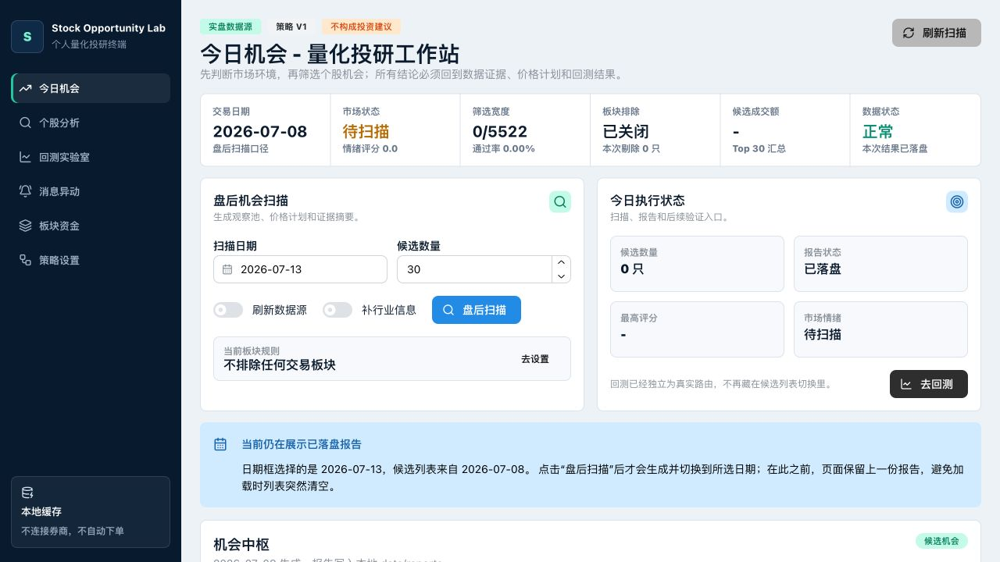
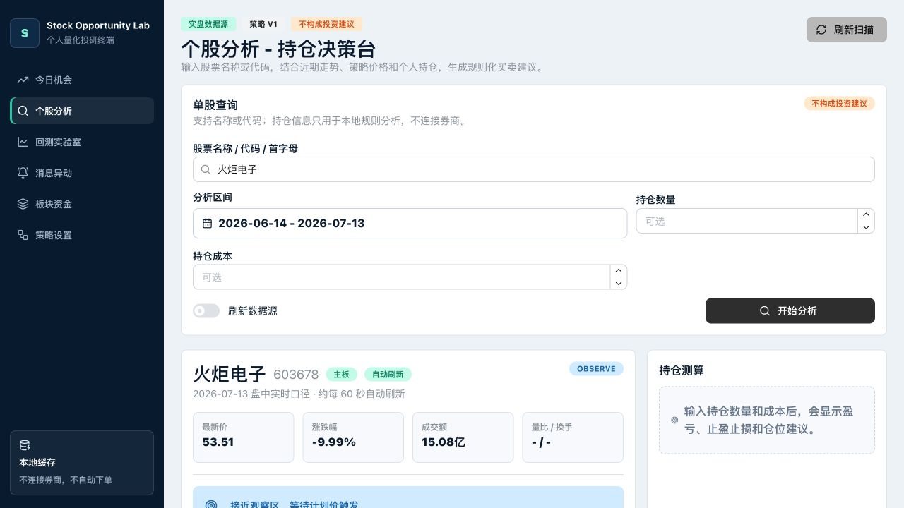
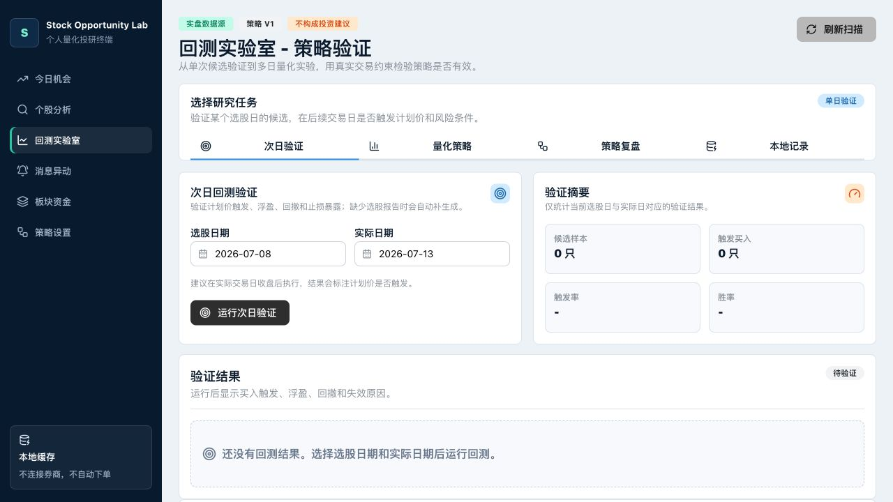
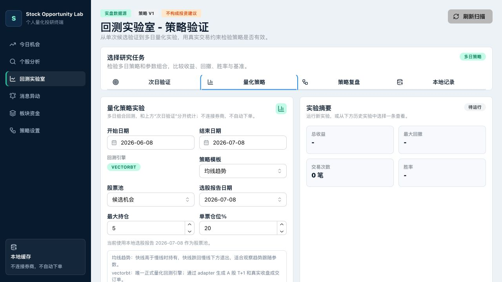
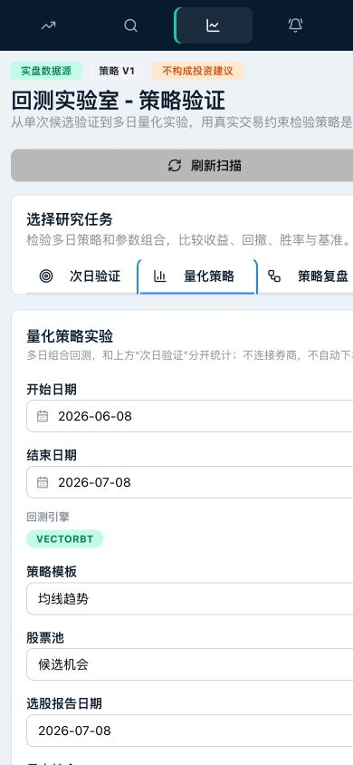
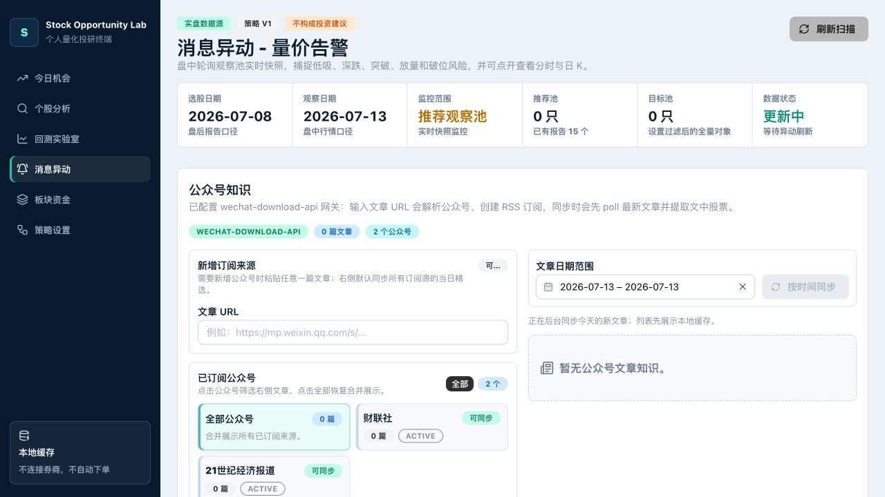
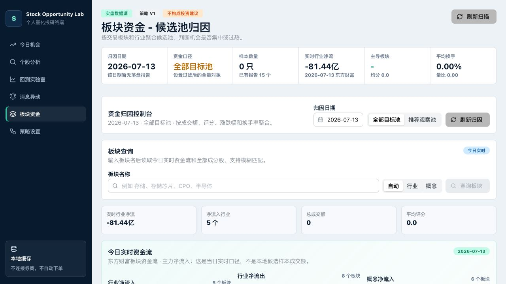

# Stock Opportunity Lab 产品使用手册

> 适用版本：2026-07-13 本地版
> 产品定位：面向 A 股个人研究者的选股、个股分析、消息跟踪、板块观察和策略验证工作台。
> 风险说明：系统不连接券商、不自动下单，所有结果只用于研究，不构成投资建议。

## 1. 快速开始

### 1.1 一条命令启动

首次使用先安装依赖：

```bash
cd stock-opportunity-lab
npm run setup
```

以后在项目根目录运行：

```bash
npm run dev
```

该命令会同时启动三个服务：

| 服务 | 地址 | 用途 |
| --- | --- | --- |
| Web | `http://127.0.0.1:5173` | 产品界面 |
| API | `http://127.0.0.1:8000` | 行情、扫描、回测和缓存 |
| 公众号网关 | `http://127.0.0.1:5500/admin.html` | 公众号登录和文章同步 |

本地模式不要求连接外部数据库。结构化记录默认保存到 `data/stock_lab.sqlite3`，行情缓存位于 `data/history/`，扫描和回测报告位于 `data/reports/`。

### 1.2 推荐使用顺序

1. 在“今日机会”运行盘后扫描，得到候选股票和计划价。
2. 在“个股分析”查看走势、分时、财务、公告、新闻和龙虎榜。
3. 在“消息异动”和“板块资金”补充消息面、行业与成分股证据。
4. 在“回测实验室”验证单次计划，或运行多日量化策略。
5. 在“策略设置”确认当前账户可交易板块和通知配置。

## 2. 今日机会



“今日机会”是选股入口。它先展示市场和扫描状态，再给出候选列表、价格计划和证据摘要。

### 2.1 盘后扫描

1. 选择“扫描日期”。非交易日建议选择最近一个交易日。
2. 设置“候选数量”，默认 30 只。
3. “刷新数据源”只在需要主动绕过本地缓存时打开。普通查看保持关闭更稳定。
4. “补行业信息”会增加上游请求和等待时间，只在需要行业字段时打开。
5. 点击“盘后扫描”。运行中旧报告会继续保留，避免候选列表突然清空。

页面顶部展示交易日期、市场状态、筛选宽度、板块排除、候选成交额和数据状态。扫描结束后，结果会写入本地报告。

### 2.2 日期与报告口径

日期框表示“准备扫描的日期”，候选列表表示“已经成功落盘的报告”。两者不一致时，页面会显示蓝色提示，明确列出所选日期和当前报告日期。

看到该提示时：

- 只想查看旧结果：无需操作。
- 想切换到新日期：点击“盘后扫描”，等待新报告成功生成。
- 扫描失败：旧报告仍可查看，不会被空白页替换。

### 2.3 候选卡片

每只候选包含：

- 综合评分与策略标签。
- 低吸区间、突破确认、高开放弃、止损和第一止盈。
- 成交额、换手率、量比、流通市值等证据。
- 小型日 K 趋势图和回测学习提示。

点击股票名称或图表可进一步查看行情；点击“去回测”进入该报告对应的验证流程。

## 3. 个股分析



“个股分析”用于把一只股票从搜索、行情、计划价一直研究到消息和财务证据。

### 3.1 搜索与偏好

输入股票名称、6 位代码或拼音首字母，例如 `火炬电子`、`603678` 或 `zckj`。点击过的搜索结果会保存在浏览器本地；下次输入同类首字母时，常用股票会优先出现。

先在下拉候选中确认股票，再点击“开始分析”。直接输入完整代码也可以分析。

### 3.2 分析区间与持仓

- “分析区间”控制日 K、公告和情报的观察范围。
- “持仓数量”和“持仓成本”均为可选项。
- 填写持仓后，系统会增加盈亏、止盈止损和仓位建议。
- 持仓信息只保存在本地规则分析中，不会连接券商。

### 3.3 行情与策略计划

分析结果依次展示：

1. 最新价、涨跌幅、成交额、量比和换手率。
2. 低吸区间、突破确认、高开放弃、止损和止盈。
3. 5 日、20 日和 60 日走势，以及 MA5、MA20 和区间位置。
4. 交易日盘中展示分钟行情，历史日期展示日 K。
5. 财务概览、三大报表和公告年报。

“刷新数据源”会请求上游重新获取数据，速度更慢。普通查询优先使用缓存即可。

分时请求超过 10 秒会进入错误态，不再无限显示加载。点击“重试分时”可单独重试，不影响已经加载好的主体分析。

### 3.4 公告、新闻与龙虎榜

“个股情报”包含三个页签：

- 公告：按分析区间读取公司公告。
- 新闻：按所选股票和日期检索公开新闻。
- 龙虎榜：按分析结束日观察；未在当日上榜时会说明最近上榜日期。

龙虎榜日期不会替换用户选择的区间。它只说明股票在观察日是否上榜，以及最近一次可用记录。

## 4. 回测实验室

回测实验室分为“次日验证”“量化策略”“策略复盘”和“本地记录”四种研究任务。顶部切换后，页面只展示该任务需要的控件，避免把不同统计口径混在一起。

### 4.1 次日验证



该模式验证某个选股报告中的计划价，在后续交易日是否真实触发。

1. 选择“选股日期”，它必须对应一份已经落盘的扫描报告。
2. 选择“实际日期”，通常为后续交易日。
3. 点击“运行次日验证”。
4. 查看候选样本、触发买入、触发率、胜率、浮盈、回撤和失效原因。

次日验证回答的是“这份候选计划后来有没有触发”，不是多日组合收益。

### 4.2 量化策略



量化策略是独立的多日组合实验。它使用 `vectorbt` 引擎，并遵守 A 股 T+1、100 股整数手和交易成本约束。

#### 第一步：确定研究范围

- 开始日期和结束日期：组合回测区间。
- 策略模板：如均线趋势、放量突破、横截面动量排名、RSI 均值回归和当前机会池复刻。
- 股票池：候选机会、筛选通过池或手动代码。
- 选股报告日期：使用报告股票池时必须选择。
- 最大持仓与单票仓位：两者共同决定资金分配。

#### 第二步：确认策略参数

基础参数直接显示在表单中。手续费、滑点和参数网格收在“高级设置”里，日常运行无需反复浏览全部参数。

开启参数实验时，页面会显示实际组合数量。组合数限制为 1 到 36 组，避免误操作提交过大的网格任务。

#### 第三步：看运行前检查

“运行前检查”是提交前的唯一判断入口：

- 绿色“检查通过”：日期、股票池、参数和引擎均可运行。
- 黄色阻断项：会逐条写出缺少报告、手动代码为空、参数组合过多或引擎不可用等原因。
- 运行按钮只有在检查通过后才可用。

按钮上方还会汇总回测区间、股票池、策略参数、参数实验和资金假设。提交前应逐项核对。

#### 第四步：查看结果

任务提交后在后台运行，切换页面不会取消。完成后重点查看：

| 指标 | 解释 |
| --- | --- |
| 总收益 | 区间期末权益相对初始资金的变化 |
| 最大回撤 | 组合从高点到低点的最大跌幅 |
| 胜率 | 已平仓交易中盈利交易占比 |
| 交易次数 | 实际生成的平仓交易数 |
| 收益曲线 | 策略累计收益与基准对比 |
| 每日策略 | 每天的买入、卖出、持仓和未成交原因 |
| 参数排名 | 不同参数组合的收益、回撤和交易表现 |

总收益高但回撤过大、交易次数过少或只依赖少数股票时，都不应直接视为可用策略。

#### 历史实验的上下文

历史实验默认不会自动冒充当前表单结果。点击历史记录后，摘要会标记“历史结果”；如果日期、股票池或报告与当前表单不一致，页面会明确提示先恢复参数或重新运行。

移动端也可以完成参数检查和提交：



### 4.3 策略复盘与本地记录

- “策略复盘”用于查看学习汇总、相似样本和策略标签表现。
- “本地记录”用于查看已落盘报告和历史任务入口。
- 量化实验文件保存在 `data/reports/quant_runs/`。

更详细的成交约束和报告文件说明见 [量化策略系统操作手册](./quant-backtest-operation-manual.md)。

## 5. 消息异动



该页面包含盘中异动和“公众号知识”。公众号模块可以保存多个订阅来源，按日期同步文章，并通过 AI 提取文章中的股票、机会、风险和主题。

### 5.1 订阅公众号

1. 在公众号网关登录微信公众平台账号。
2. 在“新增订阅来源”粘贴任意一篇公众号文章 URL。
3. 点击“解析此文并订阅”。系统识别公众号名称并保存后续 Feed。
4. 已订阅公众号会显示文章数量和可同步状态。

手动 Feed/API URL 只用于替换自动生成的来源，普通用户可以留空。

### 5.2 同步和筛选

- 日期范围支持连续选择起止日期。
- 默认查看当天所有已订阅公众号。
- 点击公众号卡片只筛选该来源，点击“全部公众号”恢复合并列表。
- “按时间同步”会拉取所选时间附近的网关历史文章并写入缓存。
- 每篇文章可点击“原文”跳转到公众号文章。

文章提取到的股票支持悬浮查看分时和日 K。悬浮卡片可进入、可切换周期，数据失败时会显示错误而不是持续加载。

## 6. 板块资金



“板块资金”用于观察行业和概念资金流，并进一步下钻全部成分股。

### 6.1 看资金排名

- 选择归因日期，查看行业净流入、行业净流出和概念净流入。
- 排名同时展示板块涨跌幅、主力净流入和代表股票。
- 默认列表是资金排名结果，不代表市场全部板块。

### 6.2 查询任意板块

在板块搜索中输入名称，例如“存储”“半导体”或“非金属材料”。选择候选后可查看：

- 板块当日资金和涨跌情况。
- 全部成分股、代码、价格、涨跌幅、成交额和换手率。
- 成分股悬浮分时和日 K。

板块名称存在行业、概念和别名差异，必须从搜索候选中选择，不建议只输入文本后直接提交。

## 7. 策略设置

设置页集中管理扫描前置条件，不在扫描页重复堆叠参数。

### 7.1 账户权限过滤

开启“启用板块排除”后，可排除创业板、科创板和北交所。快捷按钮支持：

- 排除双创和北交所。
- 只排除北交所。
- 清空排除。

设置只影响下一次扫描，不会改写已经生成的历史报告。

### 7.2 账户和通知

填写完整通知邮箱后可保存账户标识，并发送通知测试。通知只用于后台任务完成提醒。

### 7.3 策略参数快照

页面只读展示当前 V1 的成交额、换手率、量比、流通市值、高开放弃和止损参数，用于确认扫描口径。

## 8. 加载、缓存与错误处理

### 8.1 什么时候使用缓存

日常查看默认使用本地缓存，页面会更快、更稳定。扫描、文章同步和回测成功后都会把结果落盘，下次进入页面可直接读取。

只有在以下情况打开“刷新数据源”：

- 当天行情已经变化，缓存明显过旧。
- 上一次上游响应不完整。
- 正在排查数据源问题。

### 8.2 页面一直加载怎么办

1. 先看当前模块是否已经显示主体数据，局部图表失败不影响其他内容。
2. 等待错误态出现，再使用局部“重试”或重新执行该任务。
3. 不要连续点击多个刷新按钮，上游请求可能因此互相占用。
4. 检查 API：`curl http://127.0.0.1:8000/api/health`。
5. 仍不可用时重启 `npm run dev`，本地缓存和报告不会丢失。

### 8.3 数据日期看起来不对

优先核对四个日期：扫描日期、报告日期、行情交易日和回测区间。非交易日、停牌或上游只提供最近交易日时，界面会保留实际数据日期，不会伪造当天数据。

## 9. 一套完整选股示例

1. 在“今日机会”选择最近交易日并完成盘后扫描。
2. 挑选评分靠前且交易计划清晰的 3 到 5 只股票。
3. 在“个股分析”检查 60 日位置、均线、当天分时、公告和财务变化。
4. 在“消息异动”确认是否存在高风险消息，在“板块资金”检查所属板块和同板块成分股强弱。
5. 在“次日验证”检验计划价是否经常真实触发。
6. 在“量化策略”用多日区间比较收益、最大回撤和基准，不只看单次涨跌。
7. 只把证据一致、风险边界明确的股票留在人工观察池。

这套流程的目标不是给出“必涨答案”，而是把选股、证据、价格计划和验证结果放进同一条可复盘链路。
